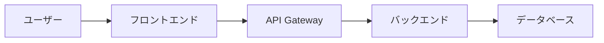
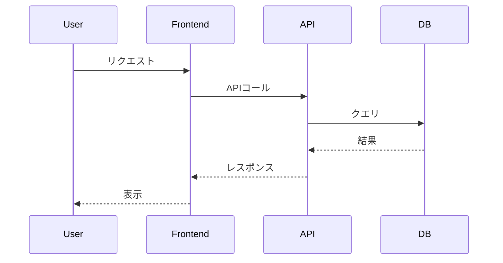

# 下書き

## 発表情報

- タイトル: システムアーキテクチャ解説
- 発表時間: 10分
- 対象者: エンジニア
- 目的: システム構成を図解で説明

## 図解

### フローチャート

```mermaid
flowchart LR
    A[ユーザー] --> B[フロントエンド]
    B --> C[API Gateway]
    C --> D[バックエンド]
    D --> E[データベース]
```

### シーケンス図

```mermaid
sequenceDiagram
    User->>Frontend: リクエスト
    Frontend->>API: APIコール
    API->>DB: クエリ
    DB-->>API: 結果
    API-->>Frontend: レスポンス
    Frontend-->>User: 表示
```
