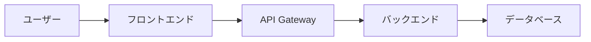
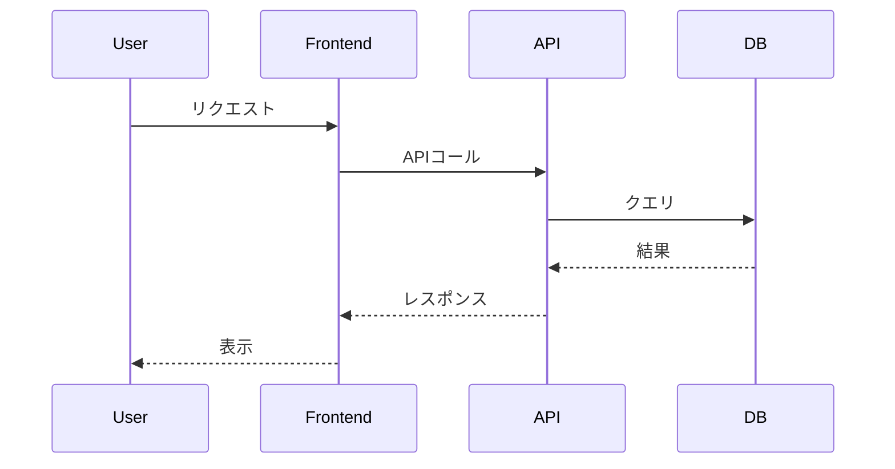

# システムアーキテクチャ解説

図解で理解するシステム構成

---

# アジェンダ

1. 全体構成
2. データフロー
3. まとめ

---

# 全体構成

システムの主要コンポーネント

---

# データフロー

リクエストからレスポンスまで

---

# 各コンポーネントの役割

| コンポーネント | 役割 |
|--------------|------|
| フロントエンド | UI表示、ユーザー入力処理 |
| API Gateway | 認証、ルーティング |
| バックエンド | ビジネスロジック |
| データベース | データ永続化 |

---

# まとめ

- シンプルな3層アーキテクチャ
- API Gatewayで認証を一元化
- 各層の責務が明確

---

# ご清聴ありがとうございました
