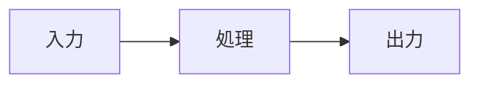
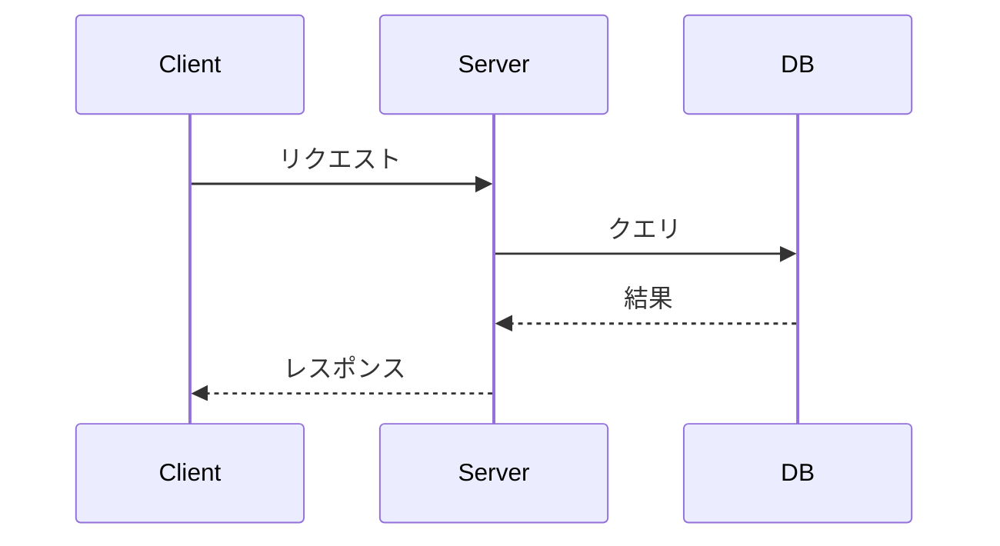
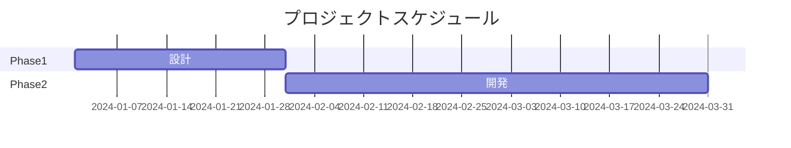

# 4_marp_ai_image - AI画像生成連携

## 概要

Marp + Gemini（Nano Banana Pro / Imagen）で図解・画像を自動生成。
Mermaid記法で構造を定義し、AIで高品質な図解を生成。

## ディレクトリ構成

```
4_marp_ai_image/
├── 1_input/           # 下書き・アイデア
├── 2_slides/          # Marp形式スライド
├── 3_output/          # HTML/PDF出力
├── images/            # 生成された画像
├── scripts/
│   └── gemini_image.py   # 画像生成スクリプト
├── .claude/
│   └── commands/
│       └── generate-image.md
└── CLAUDE.md          # 本ファイル
```

## ワークフロー

```
1. 1_input/draft.md に内容 + Mermaid記法で図解定義
    ↓
2. Claudeでスライド生成 → 2_slides/slides.md
    ↓
3. /generate-image でMermaidから画像生成 → images/
    ↓
4. スライドの画像パスを更新
    ↓
5. ビルド → 3_output/
```

## Mermaid記法例

### フローチャート



### シーケンス図



### ガントチャート



## 画像生成プロンプト

Mermaidコードをプロンプトに含めると品質が安定する:

```
以下のMermaidで定義された構造を、
プレゼンテーション用の美しい図解として生成してください。

スタイル: ミニマル、プロフェッショナル
カラー: 青系 (#2563eb)
背景: 白

[Mermaidコード]
```

## 依存ツール

- Marp CLI
- Python 3.x
- Gemini API / Vertex AI

## 環境変数

```bash
export GOOGLE_API_KEY="your-api-key"
# または
export GOOGLE_APPLICATION_CREDENTIALS="path/to/service-account.json"
```
